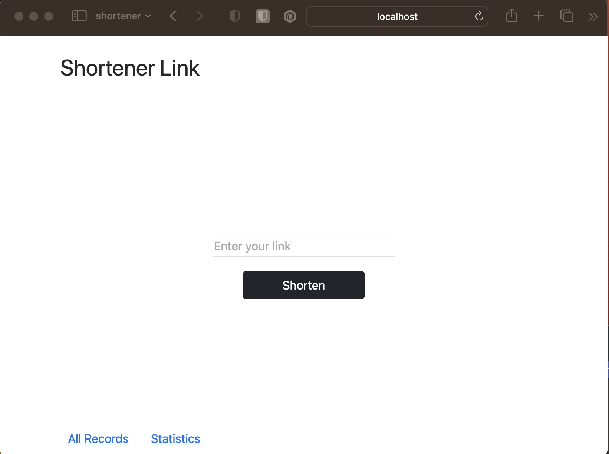
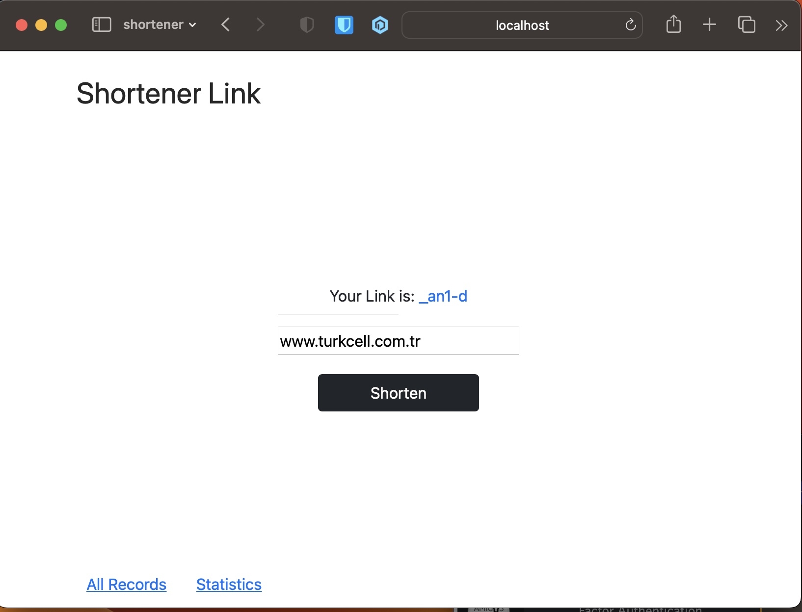
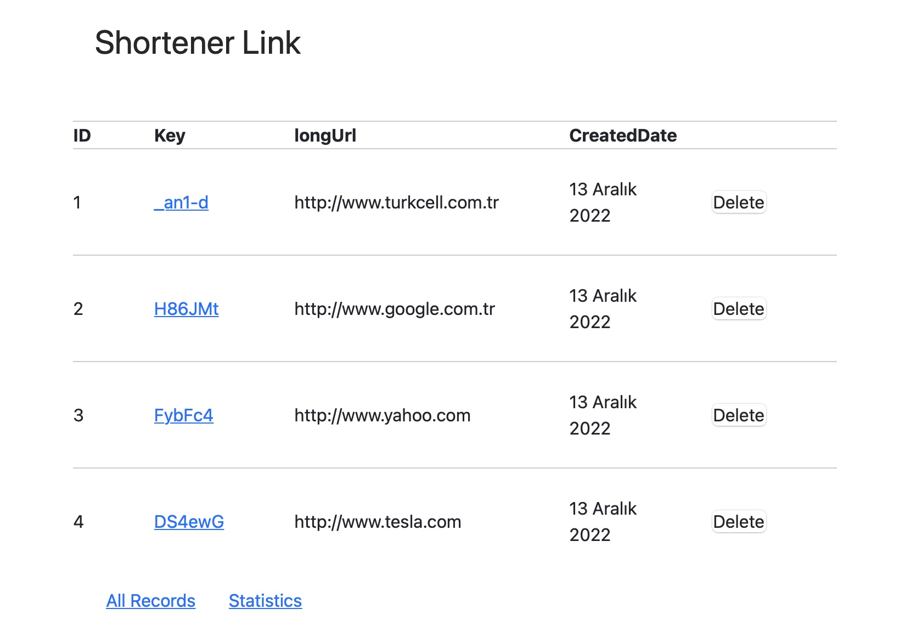
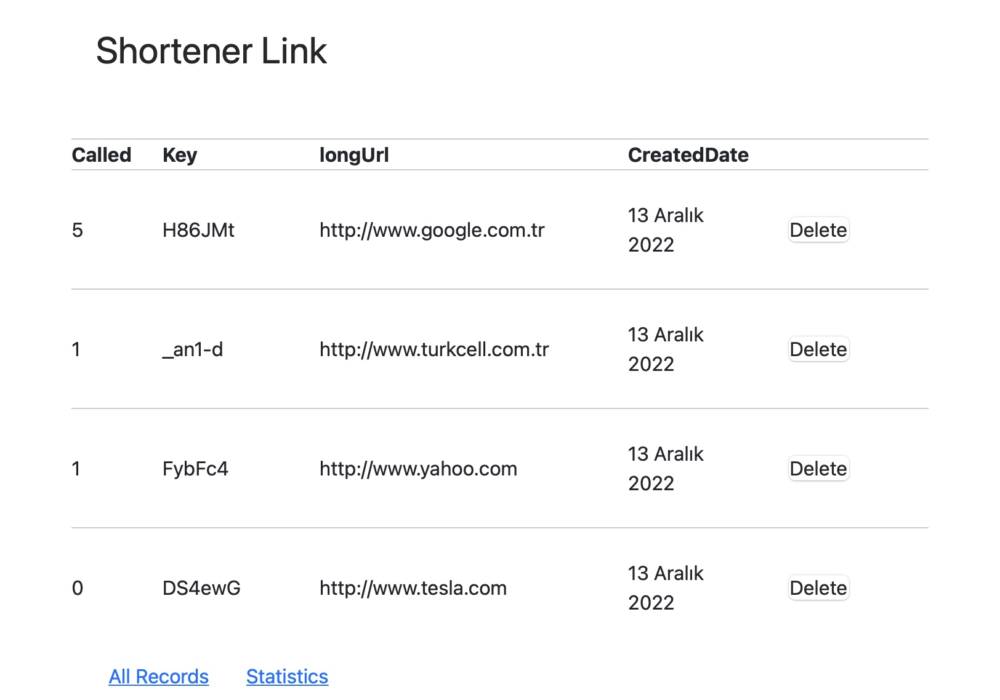

# A Full Stack URL Shortener
### by Spring Boot and React

---
A simple full stack app for creating short urls like bit.ly

[orkun.li/slnk](orkun.li/slnk)

*  [x] Simple link shortener service (similar to bit.ly)
    * [x] Front page
      * [x] React page
    * [x] Form for submitting a link 
    * [x] After submitting a link, the user receives a shortened link
    * [x] Additionally the user receives a link to the statistics page for the shortened link 
    * [x] Clicking a shortened link redirects the user directly to the original link
    * [x] Statistics page 
    * [x] Chart or table with link clicks per day 
    * [x] Button for deleting the link
    * [x] Docker
    * [x] Docker Compose
    * [ ] QR Code Implementation
    * [ ] BARCODE implementation
    * [ ] Terraform for AWS Beanstalk

---
#### Optional
  * [ ] Deploy!
  * [ ] Alias domain

---
## Start backend
* Go inside backend folder then type  ```mvn spring-boot:run``` to launch backend.
* Or you can type ```mvn clean package``` to generate a JAR file and then start server with ```java -jar path/to/jar/file``` (Normally in inside backend/target/) 

## Start frontend
* Go inside frontend folder and then type ```npm run start```

---
### Main Screen, by React



---
### Short Url Service



---
### All URL recrods



---
### Some URL statistics like how many called <i>(under construction)</i>




---
#### Example
